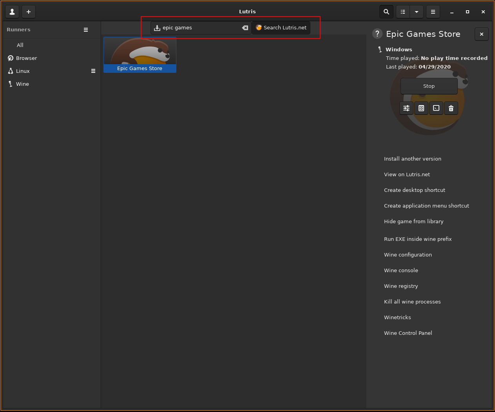
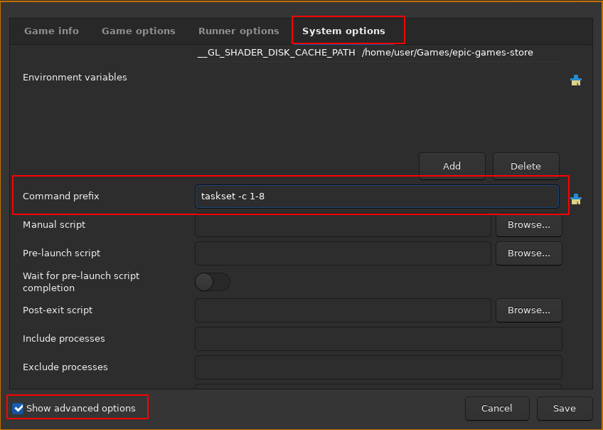

Spent a little time today getting MechWarrior 5: Mercenaries running on Fedora. Didn't end up being too complicated:

```
sudo dnf install lutris wine-dxvk
```

Once you have lutris, start it up and search for the epic games store on Lutris.net and install it.



Once it's done installing make sure you know which directory it installed to, mine defaulted to `/home/<username>/Games/epic-games-store` and put it in the below command.

```
git clone https://github.com/z0z0z/mf-install /tmp/mf-install
WINEPREFIX="/home/<username>/Games/epic-games-store" /tmp/mf-install.sh
```

Once that's done change the configuration to limit cpus to 8 cores by adjusting the configuration:

- check the `Show advanced settings` box
- go to the `System options` tab
- scroll down to the `Command prefix` box and enter the following

```
taskset -c 1-8 
```



You should be good to go after that - launch the Epic Games Store and install MechWarrior 5: Mercenaries and run it.