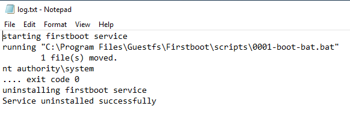

I was working on getting a generic Windows 10 VM set up for cyber testing in my lab and I didn't want to have to keep bothering with re-downloading and re-configuring all the time. This walkthrough shows you how to download the Windows developer VM, switch it over to a qcow2 image, and inject a boot script so it can always boot up to the same configuration each time. Note that you should keep a pristine image (unactivated) or snapshot it so you can reset the 90 day restriction when you need to.

Get base image file from here: [https://developer.microsoft.com/en-us/microsoft-edge/tools/vms/](https://developer.microsoft.com/en-us/microsoft-edge/tools/vms/) 

Download the `VirtualBox` version.

Password: `Passw0rd!`

- Install dependencies:

```
mingw32-gcc
automake
libguestfs-tools
```

- Convert image to qcow2

```
unzip <edge-vm.zip>
tar -xvf <edge-vm.ova>
qemu-img convert -O qcow2 <edge-vm>.vmdk <edge-vm>.qcow2
```

- Install https://github.com/rwmjones/rhsrvany

```
git clone https://github.com/rwmjones/rhsrvany /tmp/rhsrvany
cd /tmp/rhsrvany
autoreconf --install
autoconf
mingw32-configure
make
sudo mkdir -p /usr/share/virt-tools
sudo cp /tmp/rhsrvany/RHSrvAny/rhsrvany.exe /usr/share/virt-tools/
sudo cp /tmp/rhsrvany/pnp_wait/pnp_wait.exe /usr/share/virt-tools/
```

Now we can make our boot script:

```
echo "whoami" > boot.bat
```

And insert the boot script into the Windows image:

```
virt-customize -a <edge-vm>.qcow2 --firstboot boot.bat
```

Boot the VM and check the file in `C:\Program Files\Guestfs\Firstboot\log.txt`


